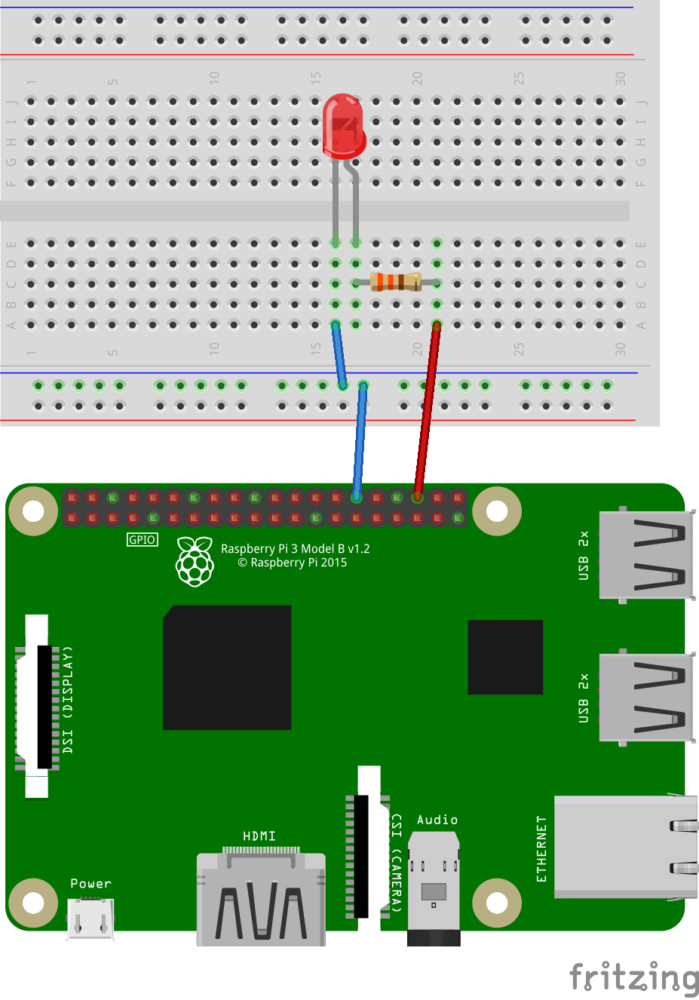

# IoT Exercise 1

In this exercise we will control a LED on our breadboard using commands from an
application connected to IoT Open. This is exactly how a switch or any on/off
actuator works.

## Material

- Raspberry Pi with 64bit operating system
- Breadboard and some connection cables
- A LED
- A 330 Ohm Resistor

## Preparations

- Install Raspberry Pi OS 64bit on your Raspberry (if you haven't already). Make
  sure you can log in to it from your laptop.
- You should have an account on IoT Open

## Learning goals

- Actuators (Control real things via IoT, unlike sensors that just collects data)
- Communication via MQTT
- Edge Clients
- How topic\_write works in IoT Open
- Starting point for following exercises

## Steps to make this happen

### Milestone I

1. Make sure you can login to your Raspberry Pi and that it is arm64.
1. Make the circuit as the image above.
1. Test the circuit with these commands
   1. `echo 16 > /sys/class/gpio/export` # Enable the pin as GPIO
   1. `echo out > /sys/class/gpio/gpio16/direction` # Set it to OUTPUT
   1. `echo 1 > /sys/class/gpio/gpio16/value` # The LED should be lit
   1. `echo 0 > /sys/class/gpio/gpio16/value` # The LED should be dark
   1. Test 3 and 4 over and over.
1. Do not move to the next section until it works and you know why!
