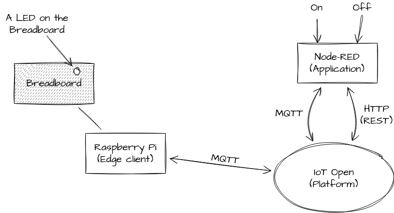
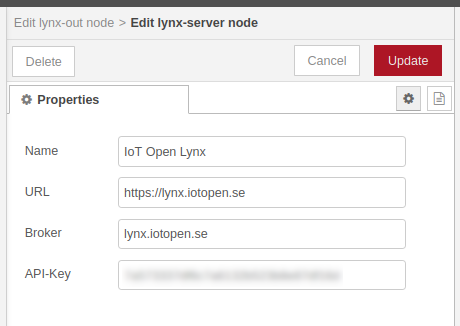
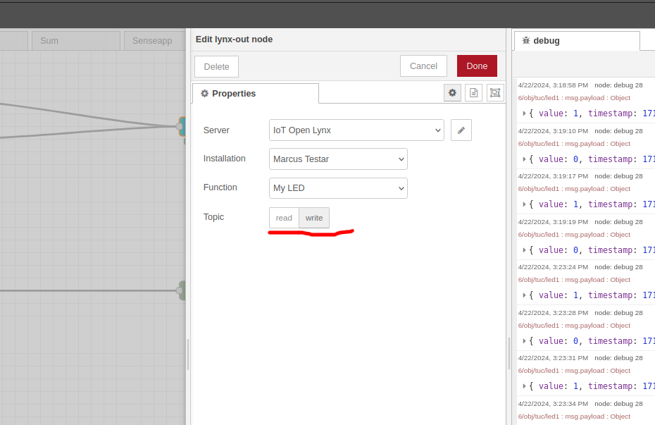
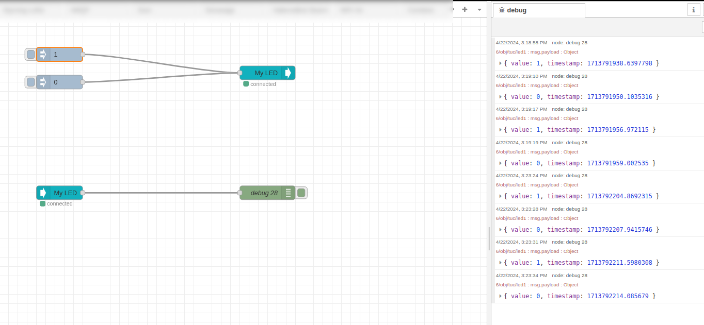

# IoT Exercise 1

In this exercise we will control a LED on our breadboard using commands from an application connected to IoT Open. This is exactly how a switch or any on/off actuator works. This will also work as a foundation for the upcoming exercises.



## Material

- Raspberry Pi with 64bit operating system
- Breadboard and some connection cables so that you can connect the pins from the Raspberry Pi to your breadboard.
- A LED
- A 330Ω Resistor\*

In [this photo](../images/exercise-1-circuit-photo.jpg) you can see all the components needed.

_\*) 330Ω is not exact, if higher the LED will glow less intense. Newer go under 200Ω since that may damage your Raspberry Pi._

## Preparations

- Install Raspberry Pi OS 64bit on your Raspberry (if you haven't already). Make sure you can log in to it from your laptop.
- You should have an account on IoT Open that you can log into from earlier exercises.

### Sources for more information

- [Raspberry Pi Documentation, Getting started](https://www.raspberrypi.com/documentation/computers/getting-started.html)
- [IoT Open Platform](https://lynx.iotopen.se)
- [How To Use A Breadboard](https://www.build-electronic-circuits.com/breadboard/)
- [Resistor color code calculator](https://www.calculator.net/resistor-calculator.html)


## Learning goals

- Actuators (Control real things via IoT, unlike sensors that just collects data)
- Communication via MQTT
- IoT Open Edge Client
- How `topic_write` and the MQTT-payload format works in IoT Open
- Starting point for following exercises

## Steps to make this happen

### Milestone I (Electronics prototype and verification)

Make the electronics work and the LED to flash.

1. Make sure you can login to your Raspberry Pi and that it is arm64.
1. Make the circuit as in [this image](../images/exercise-1-circuit.png).
1. Test the circuit with these commands
   1. `gpioset gpiochip0 16=1` # The LED should be lit
   1. `gpioset gpiochip0 16=0` # The LED should be dark
   1. Test 3 and 4 over and over.
1. Do not move to the next section until it works and you know why!

[A photo of my circuit](../images/exercise-1-circuit-photo.jpg).

### Milestone II (Software POC)

Since we will use Python in the next milestones let's make sure it works for us to control the LED.

1. Make sure you passed milestone I.
1. Save [this program](../code/led_flash.py) as `led_flash.py`
1. Run it like `python python led_flash.py`
1. The LED should be lit for one half second.
1. Do not move to the next section until it works and you know why!

### Reflection

Ok, where are we?

Now we can control the LED with Python code. That's cool. We could now write local logic to make some cool stuff but only locally on the Raspberry Pi. To connect this to the world and make IoT of it we need to do some more. There are (at least) two ways to do this. We could have the code connect to the platform itself. That would be like a native sensor/actuator where the Raspberry Pi acts as a large device. An other way to do it is to let the Raspberry Pi be an Edge Client and have some capabilities of its own. Here we go the second route an connect the Raspberry Pi as an Edge Client. 

### Milestone III (Establish connection)

1. Make sure your Raspberry Pi have access to the internet (port 443 and 8883 needs to be open from the RPi and out)
1. Please make a backup of important stuff on your RPi if any.
1. Prepare the Edge-client in IoT Open (installation -> Settings -> Edge client Create new credentials) and save the Credentials somewhere.
1. Run the script at https://github.com/mrejas/rpi-edge-client.sh/blob/main/iotopen-lynx-edge-client.sh
1. Verify in IoT Open that the Edge-Client is connected.
1. Do not move to the next section until it works and you know why!

### Milestone IV (Verify MQTT traffic)

1. Make sure you have achieved milestone III
1. Log in to IoT Open
1. Open a console (ssh or terminal) on the Raspberry Pi
1. Navigate to the MQTT-window in IoT Open on your Installation
1. Type the following on the Raspberry Pi `mosquitto_pub -t obj/test -m "Hello World"`
1. In the MQTT-window in IoT Open you should now see `<clientid>/obj/test Hello World`
1. Test is ready, do not move on until it works and you know why!


### Milestone V (Use MQTT to control the LED)

1. Make sure you passed milestone IV
1. Log in to the Raspberry Pi and open TWO consoles.
1. Install paho python lib on your RPi: `sudo apt-get install python3-paho-mqtt`
1. Save [this program](../code/integration_v1.py) as `led_integration_v1.py` and start it (it will "hog" your terminal, that's why you want two.) You can stop the program with `Ctrl-C`, but don't do that now.
1. In the other console run `mosquitto_pub -t set/tuc/led1 -m '{"value": 0}'`
1. Change the `0` to something else (e.g. `1` or `255`) and see what happens (The LED should be unlit on 0 and lit on any other number).
1. Take a look at the MQTT window in IoT Open or the Workbench to see what happens.
1. Do not move to the next section until it works and you know why!


### Milestone VI (Create a function on IoT Open for the LED)

1. Make sure you have achieved Milestone V
1. Log in to IoT Open and navigate to your installation
1. Navigate to functions and create a new function
1. Call it "MyLED" or whatever you see fit
1. Give it type `switch`
1. In the meta data section add `topic_write` with value `set/tuc/led1`
1. Now you can test to turn on and off the led using the MQTT-window in IoT Open or the data fiddler in the Workbench.
1. Take a look at the MQTT window in IoT Open or the Workbench to see what happens.
1. Do not move to the next section until it works and you know why!

### Reflection

Now we can control the LED with `topic_write`. But how will we know the status of the LED? You might think that we can do that by listening to `topic_write` but that would only work to some extent because what we are monitoring then is when the LED was asked to be set to a certain state, not that it actually was. If the Rasperry Pi is offline and someone sends something to `topic_write` nothing will happen. This is one of the reasons for `topic_read` and `topic_write`.

What we want is to let the controller on the Raspberry Pi (the Python program) to report back that the LED actually was lit or unlit. This is done on `topic_read` and on a MQTT-topic starting with `obj/`. If you want to observe something you should listen to `topic_read`. Sensors that only reports data, e.g. a thermometer only needs a `topic_read`.

### Milestone VII (Create topic read and report to it)

1. Make sure you have achieved Milestone VI
1. Log in to IoT Open and navigate to your installation
1. Navigate to functions and click on "MyLED" that you created earlier.
1. In the meta data section change `topic_read` to the value `obj/tuc/led1`
1. Update your program to the program to the right.
1. Now you can test to turn on and off the led using the MQTT-window in IoT Open or the data fiddler in the Workbench.
1. Take a look at the MQTT window in IoT Open or the Workbench to see what happens.
1. Do not move to the next section until it works and you know why!

### Milestone VIII (Create a Node-RED application controlling the LED)

The goal is to have two Inject nodes sending `1` resp `0` to the LED function. Then we should be able to control the LED with these Inject nodes.

1. Generate an API Token for Node-RED on your user.
   - Click on the user icon in the top right corner and choose "My account".
   - Click on "Security" -> API-Keys
   - At the bottom click "Create new API key" and give the key a name. Copy the key end save it. 
1. In Node-RED add a Lynx out node and configure a new Lynx-server.
   
1. Configure the Lynx out to control the MyLED function on the `write`topic (that is `topic_write`)
   
1. Add two Inject nodes that sends a number `0` resp number `1` as `msg.payload`. You can leave the `msg.topic` as is.
1. Add a `Lynx In` node and configure it to the same function, but the `read` topic.
1. Connect the `Lynx in`node to a debug node.

The flow should look like this:



### Extra

If you want the integration to start whenever the Raspberry Pi starts a simple way to do this is to add the line

```python /home/pi/integration_v2.py &```

to `/etc/rc.local`. Add it above the `exit 0` on the last line. Lines after `exit 0` will not be executed.

Please make sure that the path to the script is correct and don't miss the ampersand (&) at the end. When you now reboot the Pi the script should be running.

### Reflection

If you listen on MQTT you will se IoT Open Payloads flying around. E.g. '{ "value": 1, "timestamp": 1234567}' but you inject just a `1`or `0`. Doesn't that seem strange? It is because the Lynx out node in Node-RED converts the data to the correct format if there is a single number in the flow. It is also possible to send a complete IoT Open MQTT message.

Now we have accomplished everything in this exercise. We can control our LED via two inject nodes in Node-RED. What you have done is a simple IoT application. It might not look that cool but it is the foundation in many IoT applications. In this case it is just a LED we are controlling but keep in mind that it could be pretty much anything. And you are now ready for the next step.