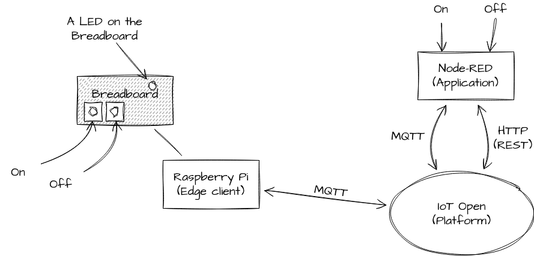
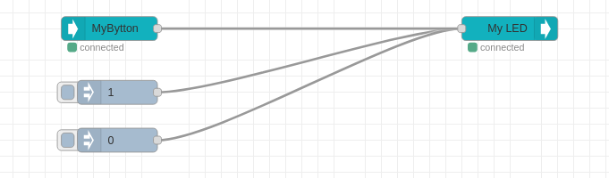

# IoT Exercise 2

Before you do this one, make sure you already have done [IoT Exercise 1](exercise-1.md).

In this exercise we will add two push buttons to the breadboard for turning the LED on and off. If you don't have any buttons you can use only connection wires and short them to simulate a push button.

We will also use the push buttons to control a friends LED.

## Material

- All things from [IoT Exercise 1](exercise-1.md) already on the breadboard and working.
- Two tactile push buttons.
- Some more connection cables.

## Preparations

- Do [IoT Exercise 1](exercise-1.md)

### Sources for more information

- [Pull up resistor](https://en.wikipedia.org/wiki/Pull-up_resistor)

## Learning goals

- Some more electronics
- The concept of "debouncing"
- The concept of "pull up" and "pull down" resistors
- Practice IoT networking
- Difference between local processing and cloud processing.

## Some background

We could easily make a circuit with only electronics to have the buttons control the LED locally. We could still send the `topic_read` information to let the world know about the LED status.

The benefit of local processing like in the example above is that the buttons will control the LED even though the connection to the cloud server is down. In many cases this is a demand.

But, on the other hand, if we instead created a function for the buttons in IoT Open we can use Node RED or some other logic to connect the buttons dynamically to other stuff around the world. That is way more flexible and have advantages.

Both local and cloud processing have pros and cons. None of them is better than the other, there are just different characteristics.

## Steps to make this happen

### Milestone I (Electronics prototype)

Add two push buttons to the board and make the circuit as in [this image](../images/exercise-2-circuit.png). Please note that the buttons have two pairs of connected pins. If the test below doesn't work try rotate the buttons 90 degrees in any direction.

Please be thorough when making the connections. If you visits the physical workshop we will have limited access to debugging tools. There is now

### Milestone II (Software POC)

### Milestone III (MQTT from the two buttons)

### Milestone IV (Verify MQTT traffic)

### Milestone V (Create a function in IoT Open for your buttons)

### Milestone VI (Connect your buttons to the LED via Node-RED)

### Milestone VI (Control your friends LED from Node-RED)

### Milestone VII (Control your friends LED from your board)

## Reflection