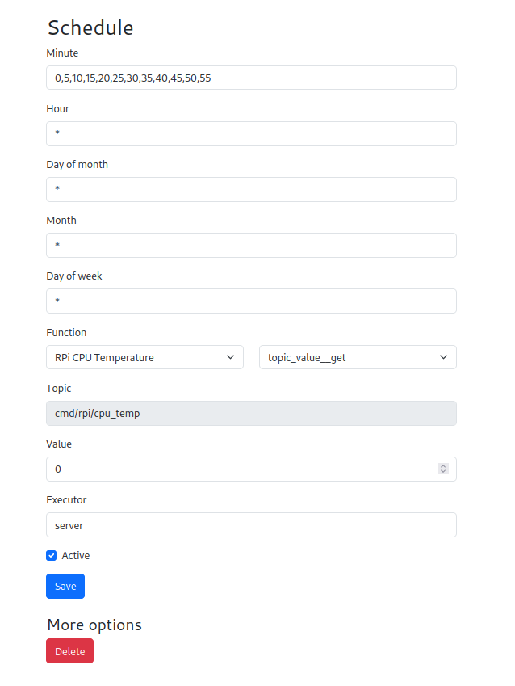

# IoT Exercise 4

In this exercise we will use a real sensor. We will use the CPU temperature sensor on the Raspberry Pi and send that to IoT Open. We will consider what is driving data in an IoT solution.

This is probably the easiest exercise yet, see this as a starting point for next exercise.

## Material

- Raspberry Pi, set up as IoT Open Edge Client
- Make sure the Edge Client in IoT Open is green!

## Preparations

- Make sure that the Edge Client in IoT Open is green.
- Make sure mqtt-paho is installed `sudo apt install python3-paho-mqtt` and/or `sudo apt install python-paho-mqtt`

### Background and what we will do

We are going to read the internal temperature of the CPU and send that on MQTT. We are also going to create a function for it in IoT Open. We will also make sure it runs every five minutes by CRON.

## Learning goals

- Explore how an integration can work in real life.

## Steps to make this happen

### Milestone I (Download the program to your Raspberry Pi)

The program [is here](../code/cpu_read_temp.py). You can install it directly by running this command.

```
wget https://raw.githubusercontent.com/mrejas/edu-iot-hands-on/main/code/cpu_read_temp.py
```

And you can test it with

```
python3 cpu_read_temp.py

```

If it run "clean" it probably works. You can verify it in the IoT Open MQTT-window or in the workbench.


Don't move to the next section until you know it works!


### Milestone II (Create function for the data in IoT Open)

Create a function like this in IoT Open

```
Name: RPi CPU Temperature
Type: temperature
Meta->format: %0.2f °C
Meta->topic_read: obj/rpi/cpu_temp
```
And make sure you have some data on it since your tests in Milestone I.

Don't move to the next section until you know it works!

### Discussion

Ok, let's stop here for a short while. Now every time we run this program it will send the CPU temperature. That's not very convenient. There must be another way and of course it is. There are three main approaches we can explore.

1. Have another program trigger in regularly
1. Have the program execute forever and send regularly
1. Have an external process trigger it regularly

They are all valid and good in different cases. The first one is most often done by a unix-tool called cron. The second one is probably the most flexible since it can send on fixed time intervals but also on change in the value or a combination of both. Here we will examine the first and third option.


### Milestone III (Automate running with CRON)

Cron is a unix tool for scheduling things. It has a quite simple way to configure points in time. You can read more about cron [here](https://www.geeksforgeeks.org/crontab-in-linux-with-examples/). 

First we have to know exactly where our program is. If you did as we did above you should have the program in your current working directory. Let's make sure.

If you can se the program when you run `ls cpu_read_temp.py` then we know it is in the directory that is active.

```
$ ls cpu_read_temp.py 
cpu_read_temp.py
```

Then let's find out where we are by running `pwd`.

```
$ pwd
/home/iot
```

In my case `/home/iot` but yours might be different.

Then test and run the program with (change to fit)

```
python3 /home/iot/cpu_read_temp.py
```

If it works then copy that full command. Then schedule it by running `crontab -e` and at the very bottom of the file add:

```
*/2 * * * * python3 /home/iot/cpu_read_temp.py
```

(Pleas observe that yours is slightly different)

Save the file. You can verify it by running `crontab -l`

```
$ crontab -l
*/2 * * * * python3 /home/iot/cpu_read_temp.py
```

Now wait a couple of minutes (or longer) and then check in IoT Open that there is a new value every second minute.

Then run  `crontab -e` again and verify that the values stops coming in.

Now you know one way of scheduling that is very useful and are being used a lot.

### Milestone IV (Automate via external process)

Another way is to have the program listen to something outside the sensor. That might be an URL or other type of signal. It can also be a MQTT-message. Let't try another script that runs forever.

Now install another script:

```
wget https://raw.githubusercontent.com/mrejas/edu-iot-hands-on/main/code/cpu_read_temp_v2.py
```

And use the same method as above to find the full command for it. In my case I ended up with `python3 /home/iot/cpu_read_temp_v2.py` and you should end up with something similar.

Now let's make sure this script is starting automatically by adding it to `/etc/rc.local`. Open that file with:

```
nano /etc/rc.local
```

And add the this line just before `exit 0`

```
python3 /home/iot/cpu_read_temp_v2.py &
```

Don't forget the ampersand (&) at the end. Now reboot the Raspberry Pi.

When the Raspberry Pi has started you can run this command on it and watch the MQTT-traffic in Workbench or IoT Open.

```
mosquitto_pub -t cmd/rpi/cpu_temp -m '1'
```

Every time you run that command the temperature should be reported.

Don't move to the next section until it works.

Lastly add this to the function you created earlier:

```
Meta->topic_get: cmd/rpi/cpu_temp
```

### Milestone V (Use the IoT Open Scheduler)

Now we can trigger measurements from the outside. That is cool because we can get a value on demand whenever we want. But it should be nice to have them regularly also. This can be done in several ways. One way is to use cron on the Raspberry Pi as above but we can also use IoT Open and the schedule function.

Go to you installation and add schedule like this one.



Note "server" on executor.

When that schedule is saved, take a look att MQTT. Especially around every 5 minutes.


### Reflection

Here we used another topic than topic_read and topic_write. The topic_get we used now is just an example. You can use any topic you want. Observe that you can also use this topic in Node-RED or any other application to trigger a reading of the temperature.