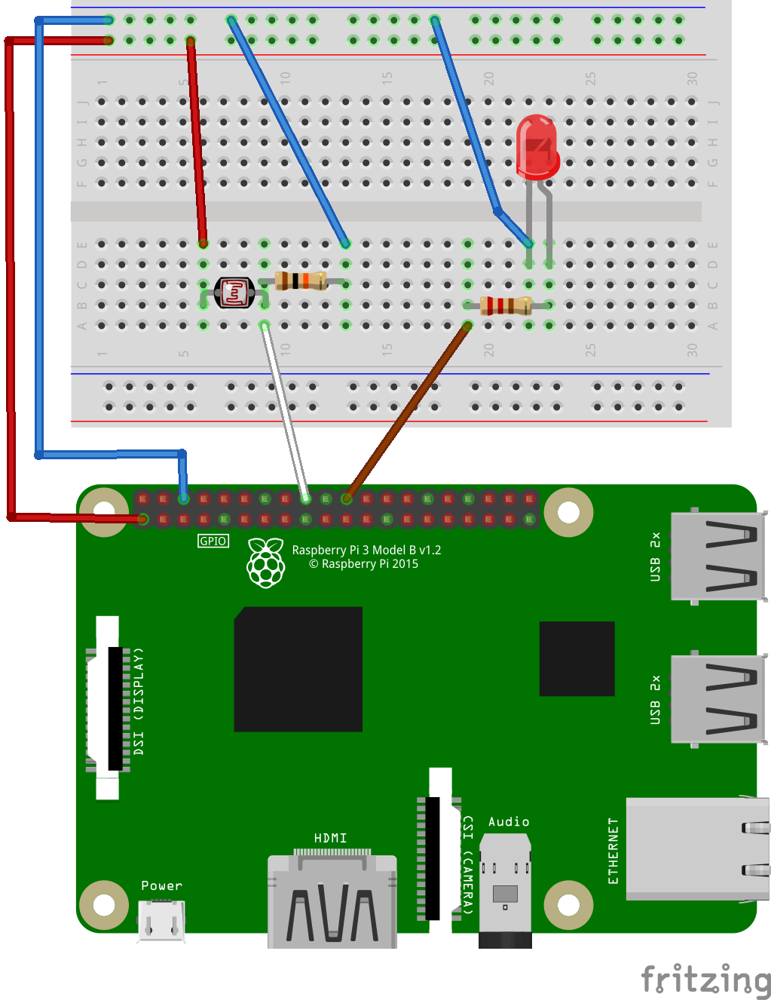

# IoT Exercise 5

In this exercise we will use a phototresistor as a sensor.

A graphical view of this exercise is [here](https://github.com/mrejas/edu-iot-hands-on/raw/main/images/exercise-5-board.png).

A [photo of the circuit used](../images/exercise-5-circuit-photo.jpg).

## Material

- Raspberry Pi, set up as IoT Open Edge Client
- Make sure the Edge Client in IoT Open is green!
- Make sure you have done exercise 1 (for the edge client)
- 1 breadboard
- 1 LED
- 1 photoresistor
- 1 220-330 ohm resistor
- 1 10k ohm resistor
- Some connection wires

In [this photo](../images/exercise-5-circuit-photo.jpg) you can see all the components needed.

## Preparations

- Make sure that the Edge Client in IoT Open is green.
- Make sure mqtt-paho is installed `sudo apt install python3-paho-mqtt` and/or `sudo apt install python-paho-mqtt`

### Background and what we will do

We are going to use a photoresistor as a sensor. In this exercise we will only use it to detect light or not light. This is how it is used for instance in ray of light applications. It van also be used to detect levels of light (illumination).

## Learning goals

- Explore another way of getting data.

## Steps to make this happen

### Milestone I (Electronics)

1. Make the circuit as in this image

1. Test the circuit with these commands
    - gpioset gpiochip0 25=1 # The LED should be lit
    - gpioset gpiochip0 25=0 # The LED should be unlit
1. We will test the photoresistor in the next milestone

### Milestone II (Software POC)

1. Save [this program](../code/photo_test.py) as `photo_test.py` on your Raspberry Pi
1. Run the program with `python photo_test.py`
1. The LED should be lit when the photoresistor i covered and vice versa

### Milestone III (Establish connection)

*Skip this step if you have done the preparations and EdgeClient in IoT Open is green!*

1. Make sure your Raspberry Pi have access to the internet (port 443 and 8883 needs to be open from the RPi and out)
1. Please make a backup of important stuff on your RPi if any.
1. Prepare the Edge-client in IoT Open (installation -> Settings -> Edge client Create new credentials) and save the Credentials somewhere.
1. Run the script at https://github.com/mrejas/rpi-edge-client.sh/blob/main/iotopen-lynx-edge-client.sh
1. Verify in IoT Open that the Edge-Client is connected.
1. Do not move to the next section until it works and you know why!

### Milestone IV (Verify MQTT traffic)

*Skip this step if you have done the preparations and EdgeClient in IoT Open is green!*

1. Make sure you have achieved milestone III
1. Log in to IoT Open
1. Open a console (ssh or terminal) on the Raspberry Pi
1. Navigate to the MQTT-window in IoT Open on your Installation
1. Type the following on the Raspberry Pi `mosquitto_pub -t obj/test -m "Hello World"`
1. In the MQTT-window in IoT Open you should now see `<clientid>/obj/test Hello World`
1. Test is ready, do not move on until it works and you know why!

### Milestone V

1. Make sure you have achieved Milestone IV (or II and you have a connection)
1. Save [this program](../code/photo_integration.py) as photo_integration.py on your Raspberry Pi
1. Start the program with `python photo_integration.py`
1. Listen on MQTT or look in the MQTT window in IoT Open and see what happens when you cover the sensor with your finger and when you are not.
1. Do not move to the next section until it works and you know why!

### Milestone VI Create a function on IoT Open for the Photoresistor

1. Make sure you have achieved Milestone V
1. Log in to IoT Open and navigate to your installation
1. Navigate to functions and create a new function
1. Call it "MyPhotoResistor" or whatever you see fit
1. Give it type "photoresistor"
1. In the meta data section add topic_read with value set/tuc/photo
1. Verify that it works by looking at the log tab for your photo function
1. Now you can use that function in Node-RED and other applications.

### Reflection

We have used another way of input data, namely a photoresistor. With this knowledge you should recognize that no mather what type of sensor that are used they work the same in any goog IoT platform. The interesting and fun part is to make the applications making good us of the data.